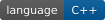
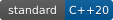
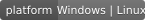
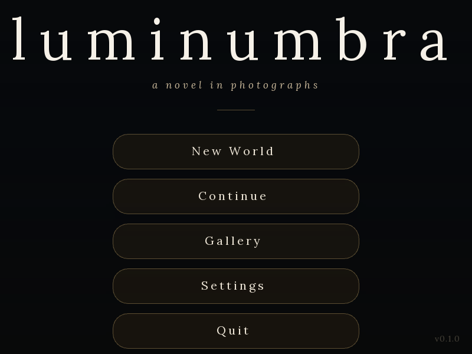

# Luminumbra

[](LICENSE)




Luminumbra is a C++20 voxel engine for a persistent simulated world. It combines
deterministic fixed-tick simulation, procedural terrain, entity-component systems,
networking, and a GPU-driven client renderer.

This is an owner-maintained hobby project. Version 0.3.0 is an early public
source release; interfaces and content formats may still change between releases.

## v0.3.0 world format break

> This world predates the v0.3.0 format and cannot be opened. Create a new world; migration is not supported.

Older saved worlds are refused with this message. Create a new world with a
current preset; there is no migration path. New saves use LMR1 container v2,
the `luminumbra.persistence.world_manifest.v1` manifest with
`container_version: 2`, and FSD2 far-LOD payload v3. Explicit preset `schema_rev`
must be `6`; in-memory callers may omit it. Terrain shaping is always applied,
and enabled caves always use the noise router. Content, hydrology, and biome
controls remain available. Unknown future formats and corrupt data have distinct
failures. See the [persistence contract](docs/engine-guide.md)
for the retired selectors and validation details.



The maintained capture above is generated by the live RmlUi/OpenGL smoke test.

## Build and test

Luminumbra uses CMake presets and Ninja. A first configure downloads dependencies
at revisions pinned by the repository, so it requires Git and network access.

```sh
cmake --preset debug
cmake --build --preset debug --parallel
ctest --preset debug -LE manual --no-tests=error --output-on-failure
```

Use `release` for optimized builds and `debug-asan` for AddressSanitizer builds.
All generated files stay under `build/<preset>/`.

The primary executables are written to `build/<preset>/bin/`:

- `luminumbra_client_app` runs the graphical client.
- `luminumbra_client_qa_app` is the QA build of the client with the scenario
  harness compiled in; the `tools/gates` scenario runs use it.
- `luminumbra_server_app` runs the headless simulation server.
- `asset_processor` converts authored models into the runtime mesh format.

See [Development and testing](docs/development.md) for platform dependencies,
validation lanes, and source-list ownership.

## Architecture

The common engine owns deterministic simulation, world generation, persistence,
replay, and networking. The client adds rendering, audio, input, and UI. The
headless server links only the common engine and advances authoritative state.

The main engine layers and their dependency boundaries are described in
[Architecture](docs/architecture.md). The terrain density and sampling rules are
defined by the [SHIELD SDF contract](docs/shield/sdf-contract.md).

## Repository layout

| Path | Purpose |
|---|---|
| `src/luminumbra_common/` | Shared simulation and engine services |
| `src/luminumbra_client/` | Client rendering, audio, input, and UI |
| `src/luminumbra_server/` | Headless server entry points |
| `test/` | CTest and GoogleTest suites grouped by subsystem |
| `tools/` | Asset processing, CI validation, captures, and developer tools |
| `cmake/` | Build modules and dependency declarations |
| Local `.glb` staging | Optional authored inputs converted by the asset pipeline; not included in this source release |
| `data/` | Runtime data copied into each build tree |
| `res/` | Runtime resources that remain source-form, including shaders |
| `worlds/` | Authored world definitions |
| `docs/` | Maintained architecture, development, and validation guides |

## Documentation

- [Engine/framework guide](docs/engine-guide.md)
- [Architecture](docs/architecture.md)
- [Development and testing](docs/development.md)
- [Performance measurement](docs/performance.md)
- [Visual regression](docs/visual-regression.md)
- [Contributing](CONTRIBUTING.md)

API documentation is built with Doxygen in CI and published from the validated
`main` branch through GitHub Pages.

## License

Luminumbra is licensed under the [MIT License](LICENSE). Third-party components
and assets retain their own terms; see
[Third-party licenses](THIRD_PARTY_LICENSES.md).
