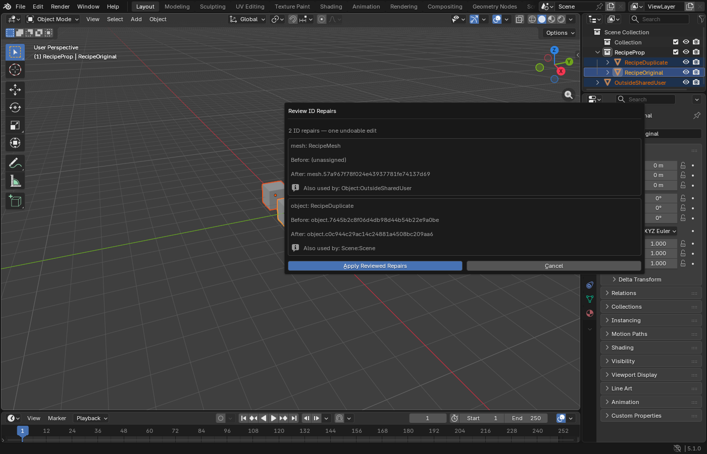

# Reviewed authoring recipes

The Blender extension can repair persistent asset identities through one named,
reviewed operation: `authoring.asset.refresh_ids.v1`. Select an already marked
asset collection and choose **Review ID Repairs**. The dialog lists the old and
proposed ID for each affected object, mesh or material, including other users of
shared data. **Apply Reviewed Repairs** performs the changes as one undoable edit.

This is an original 1400×900 screenshot from Windows Blender 5.1.0, extension
0.3.0 at source `136e823e58baa5a908597f89dbc32757c3225001`. It has no resizing,
retouching or generated content. It shows Blender's own editor and a synthetic
three-object fixture; it is not an engine-rendered viewport or production art.
Visual approval is **pending**. The [evidence record](assets/authoring-recipes/20260909/evidence.json)
pins the executable, extension archive, probe, screenshot and retained native
receipts. It records functional results separately from visual acceptance.

## Observed behavior

The isolated interactive editor passed 22 checks: installation, a non-mutating
review dialog, cancellation, exact planned application, one-step undo, exact-ID
redo, request replay after undo, scene-edit refusal, receipt-failure rollback,
document reload and extension unload. The screenshot was taken before cancelling
that dialog; the probe subsequently exercised application and undo/redo through
the actual registered operator. Fifteen portable state/recipe tests cover
additional failure injection and bounds. Native receipts retain their actual
source identity; later documentation changes do not relabel their execution.

A scene edit invalidates pending review even before an asset build session
exists. Applying repairs first invalidates any captured asset source and cancels
its pending build. Repeated request IDs return the original terminal receipt,
including after undo, without repeating the edit. Plans and receipts live under
the configured project's `.luminumbra-author-recipes/` directory, outside undo
history. If receipt writing fails, the operator restores the prior identities;
a failed rollback is reported rather than treated as success.

## Scope and limits

The first recipe accepts at most 24 ID repairs, 32 pending plans and 256 terminal
requests per document session. It inspects at most 100,000 relevant datablocks.
Initial marking, ambiguous target asset IDs, non-text identity properties and
linked/overridden data use the manual workflow or a separately qualified profile.
No remote listener, arbitrary Python execution, geometry generation or asset
replacement is supplied by this recipe. Linux editor qualification and the other
authoring recipes remain separate work.

The recorded native process took 4.531 seconds, including startup, installation,
tests and shutdown, with two CPU workers and a 120-second deadline. This is total
test-process time; no recipe latency or GPU performance target is established by
that measurement. The engine's viewport performance targets do not apply to this
Blender UI fixture.

See the [extension guide](https://github.com/d-addison/luminumbra/blob/136e823e58baa5a908597f89dbc32757c3225001/tools/blender/authoring/extension/README.md) for
installation, supported assets and receipt behavior. Run the portable contracts
with `python -B -m unittest discover -s tools/blender/authoring/extension_tests -v`.
The native probe is `tools/blender/authoring/extension_tests/native_recipe_probe.py`;
it requires an isolated interactive Blender editor with event simulation enabled,
factory startup, disabled automatic scripts and separate user resources.

## September 13 integration qualification

The integrated source `eb745a4332cbcfdd03d65f30b820521fd2c4fa4f` includes
`devel` at `7b7510d157af9712389b0ffc75fa4892c49089fb`, after the compiled prefab
runtime landing. A fresh isolated Windows Blender 5.1.0 editor passed the same
22 native obligations with the actual packaged extension. The 15 portable
adapter/recipe tests and 27 service tests also passed on this source. Linux
native editor qualification remains outstanding.

This original 1400×900 screenshot shows the two proposed ID repairs and the
shared-data users before cancelling that review. The probe then opened a fresh
plan and exercised application, undo/redo, replay, stale refusal, receipt-failure
rollback, file load and extension unload. It is a synthetic Blender editor
fixture, with visual approval **pending**.

The [new evidence record](assets/authoring-recipes/20260913/evidence.json) pins
the executed source/tree, all packaged source inputs, executable, exporter
identity, archive, probe, runner, screenshot and retained receipts. The archive
matches the historical recipe archive byte for byte because its source files
are unchanged; this record documents a separate fresh execution. The September
9 screenshot and receipt above keep their original source identity.

The owned process completed in 8.515 seconds under the existing 120-second
deadline, with two CPU workers. Executable, exporter identity, job and staged
inputs remained unchanged. That duration covers startup, installation, the
functional checks and shutdown; it does not establish recipe interaction latency
or GPU performance. No engine rendering or production-content acceptance is
claimed by this editor run.
