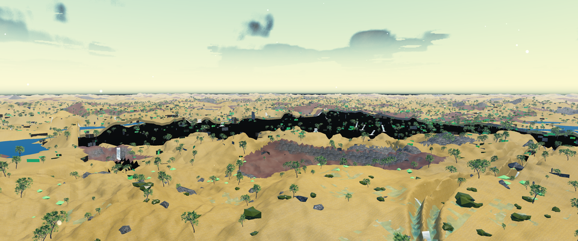
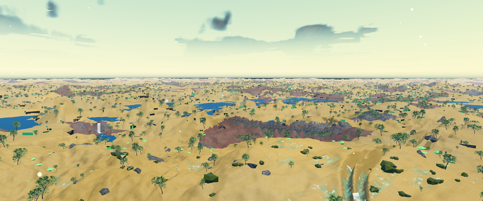

# Terrain coverage diagnostics

Use matched color and deferred attachments to distinguish missing geometry from
lighting or material problems. Settled queues and submitted draw counts do not
prove visible terrain coverage. The
[attachment contract](performance.md)
defines the formats, frame identity and diagnostic controls.

## A recorded guard comparison

These September 8, 2026 captures show the same forest camera with the ordinary
camera-region guard and with its diagnostic bypass. Both are native engine
output from source [`773f60d4b877`](https://github.com/d-addison/luminumbra/commit/773f60d4b8770616265fa93c1fb0756ea5324603).
They have **zero visual approvals**. The bypass is an experiment, not a
production fix or a validated cave, edit or water ownership policy.

| Ordinary camera-region guard | Diagnostic bypass |
|---|---|
| [](assets/terrain-coverage/20260908/forest-guard.png) | [](assets/terrain-coverage/20260908/forest-bypass.png) |

Previews are resized to 960×400 with LANCZOS filtering. Click either image for
its unretouched 3840×1600 PNG: every decoded RGB byte matches the original PPM.
These new diagnostic captures are separate from the
[historical forest baseline](visual-baselines.md), whose images
and original renderer provenance remain unchanged.

| Observation | Guard | Bypass |
|---|---:|---:|
| Capture render frame | 641 | 641 |
| Deferred pixels with depth below clear value 1 | 3,481,401 | 3,738,476 |
| Fraction of all pixels with deferred coverage | 56.6634% | 60.8476% |
| Center depth / material ID | 1 / 255 | 0.99983698 / 4 |
| Wanted / resident far regions | 132 / 132 | 132 / 132 |
| Missing / pending / stale far regions | 0 / 0 / 0 | 0 / 0 / 0 |
| Camera region terrain / water decision | guarded / guarded | submitted / submitted |
| Far draws / indices | 78 / 1,601,970 | 80 / 1,731,642 |
| Prepared live snapshots / submitted | 2,234 / 570 | 2,234 / 570 |

The bypass gains **257,075 deferred-covered pixels and loses none**. The broad
black band is visibly filled with terrain and water. Clear depth also includes
sky, so its global pixel count is not a count of defective terrain. Deferred
attachments do not describe every transparent contribution to final color.

The packets have the same executable and public input manifest, exact matching
view/projection matrices, dimensions, time of day, disabled TAAU and zero jitter.
All 2,234 capture-frame live records are identical, including uploaded mesh
versions, pool residency and culler results; none were truncated. All nine
far-neighbor records agree on bounds, authority, tiers and residency. Only region
`[0,0]` changes its terrain and water submission decisions. The increase of
129,672 indices is exactly that region's 101,376 terrain plus 28,296 water indices.

Across measured frames 401–640, far records differ only in those two decisions,
the bypass flag, draw count and index count. Both runs have zero far missing,
pending, stale and failed builds during that interval. Warmup residency did
differ between processes. These joins strongly identify guard suppression as
the source of recovered coverage in this settled view; they do not prove that
bypassing ownership rules is correct for other views or edited worlds.

## Identity and timing scope

The [compact evidence record](assets/terrain-coverage/20260908/evidence.json)
includes source/tree, executable, input-manifest, image and raw-receipt SHA-256
identities; selected original measurements; full capture far-neighbor records;
and comparison results. It records source `773f60d4b877`, rather than the later
documentation revision. Full raw AOV planes, frame logs and native process
receipts remain outside Git. Their hashes identify retained bytes; this compact
record alone cannot reproduce every raw-plane assertion.

Both runs used the shipping client, `default` world with seed 424242, camera
`(8,56,8)`, yaw 35°, pitch −6°, vertical FOV 45° and time of day 0.04. Output and
internal dimensions were 3840×1600 at scale 1.0. Each used 400 warmup frames,
240 measured frames and one additional unmeasured capture frame. All 261 public
input files remained unchanged, including 22 verified files from Tree Small 02;
no saved worlds or private audio payloads were copied. Tree Small 02 is by Rico
Cilliers / Poly Haven, CC0-1.0; see [Game assets](game-assets.md).

Native Windows Release binaries used GNU UCRT64 15.1.0 and production OpenGL,
without ASan, coverage, Tracy or Diligent. NVIDIA's startup process table matched
guard PID 51780 and bypass PID 87308 to GPU 0, an RTX 5070 Ti with driver 595.97.
Other applications were present in the shared hardware environment; their
presence alone does not establish interference.

| Recorded mean | Guard | Bypass |
|---|---:|---:|
| Frame wall time | 17.0047 ms | 21.4507 ms |
| CPU submission | 3.7096 ms | 4.0726 ms |
| Presentation | 13.2121 ms | 17.2823 ms |
| GPU pass sum | 10.1857 ms | 11.1861 ms |
| GPU board clock | 2833.22 MHz | 2813.07 MHz |
| GPU board power | 242.509 W | 268.235 W |

These are instrumented diagnostic means, with no raw timing distribution or
p95/p99. GPU pass sum is not whole-frame GPU latency; board clock/power are not
exclusive process measurements. The historical forest observation was 6.9147 ms
frame wall, 3.2277 ms GPU pass sum, 2881.22 MHz and 116.744 W; its source, binary
and instrumentation differ, so it is not a comparable regression baseline. No
qualified whole-frame target is established for this view. The foliage
diagnostic's 0.6 ms target does not transfer to this workload. Follow the
[performance policy](performance.md) for paired performance acceptance.

## Reproduce the diagnostic

Build the shipping client and acquire the public pack as described in
[Development](development.md) and [Game assets](game-assets.md). Use identical
binary, shaders, assets and world settings for both runs. Keep hot reload and
interactive settings changes disabled. This PowerShell example runs from the
repository root with an existing Release build. It creates fresh application
profiles and output directories, then restores the calling shell's environment.
The benchmark exits after capture; an automated runner should also enforce a
420-second process deadline and retain failed attempts. New runs arm the
60-second hang watchdog and keep stdout and crash artifacts on the local C:
drive, following [native acceptance](v0.3-acceptance.md). This adds instrumentation
that was absent from the historical screenshots above.

```powershell
$diagnosticRoot = Join-Path 'C:\Temp' ('luminumbra-terrain-coverage-' + [guid]::NewGuid().ToString('N'))
if (Test-Path $diagnosticRoot) { throw 'Use a fresh diagnostic directory.' }
New-Item -ItemType Directory $diagnosticRoot | Out-Null
$previousEnvironment = @{}
foreach ($name in @('APPDATA', 'LOCALAPPDATA', 'TEMP', 'TMP')) {
    $previousEnvironment[$name] = [Environment]::GetEnvironmentVariable($name, 'Process')
}
try {
    foreach ($mode in @('guard', 'bypass')) {
        $runDirectory = Join-Path $diagnosticRoot $mode
        New-Item -ItemType Directory $runDirectory | Out-Null
        foreach ($name in $previousEnvironment.Keys) {
            $profileDirectory = Join-Path $runDirectory $name
            New-Item -ItemType Directory $profileDirectory | Out-Null
            [Environment]::SetEnvironmentVariable($name, $profileDirectory, 'Process')
        }
        $extra = @()
        if ($mode -eq 'bypass') {
            $extra = @('--render-benchmark-aovs-bypass-camera-region-guard')
        }
        & .\build\release\bin\luminumbra_client_app.exe `
            --auto-create-world --auto-enter-world --world-preset default `
            --no-audio --no-ui --no-menu-backdrop --hidden-window `
            --hang-watchdog-seconds 60 --crash-dir (Join-Path $runDirectory 'crashes') `
            --cam-pos '8,56,8' --cam-yaw 35 --cam-pitch -6 `
            --runtime-artifact-dir (Join-Path $runDirectory 'artifacts') `
            --render-benchmark (Join-Path $runDirectory 'benchmark.json') `
            --render-benchmark-warmup 400 --render-benchmark-frames 240 `
            --render-benchmark-aovs (Join-Path $runDirectory 'aovs') @extra `
            *> (Join-Path $runDirectory 'engine.log')
        if ($LASTEXITCODE -ne 0) { throw "Capture failed: $mode" }
    }
} finally {
    foreach ($name in $previousEnvironment.Keys) {
        [Environment]::SetEnvironmentVariable($name, $previousEnvironment[$name], 'Process')
    }
}
```

AOV directories must not already exist. Do not remove failed outputs to make
a rerun appear successful. Validate each report's actual render and streaming
camera before interpreting the images:

```powershell
foreach ($mode in @('guard', 'bypass')) {
    py -3 tools/perf/validate_render_capture.py `
        "$diagnosticRoot/$mode/benchmark.json" `
        --position 8 56 8 --yaw 35 --pitch -6 --fov 45 --tod 0.04 `
        --require-controller --require-distinct-controller --require-geometry --require-settled
    if ($LASTEXITCODE -ne 0) { throw "Report validation failed: $mode" }
    py -3 tools/perf/inspect_terrain_aovs.py "$diagnosticRoot/$mode/aovs" `
        --benchmark "$diagnosticRoot/$mode/benchmark.json"
    if ($LASTEXITCODE -ne 0) { throw "AOV validation failed: $mode" }
}
```

That checker validates report-frame uniforms and streaming state, not complete
pixel coverage. For A/B analysis, join each complete manifest to its unique
`capture` frame observation, then compare exact camera, frame, input and binary
identities. `inspect_terrain_aovs.py` requires numpy, validates all six raw planes,
checks projection endpoints against the declared depth convention, and joins the
optional benchmark capture observation. It does not establish binary/input
identity or acquisition provenance.

Current scene depth is reversed-Z float depth: near is `1`, far/clear is `0`, and
covered pixels have depth greater than `0`. The manifest's `depth_convention`
records this explicitly; shadow-map depth uses a separate conventional contract.
The historical source773 images and numbers above used forward depth, with clear
`1` and coverage below `1`. Their original bytes and meaning are unchanged. To
inspect those older raw packets, explicitly pass `--legacy-forward-depth`; the
tool also checks their projection direction and rejects an incompatible label.
It refuses comparisons between depth conventions.

```powershell
py -3 tools/perf/inspect_terrain_aovs.py "$diagnosticRoot/guard/aovs" `
    --compare "$diagnosticRoot/bypass/aovs"
if ($LASTEXITCODE -ne 0) { throw 'AOV comparison failed.' }
```

Compare far-region records and live-mesh versions before assigning a cause.
Preserve original planes and hashes, and treat PNG conversion as a separate
artifact. Require the watchdog arm log, complete shutdown with drained jobs and
all ten headless-profile milestones, and no crash/hang reports before treating
an automated capture run as complete. None of these checks grants visual
approval or makes the diagnostic bypass a production fix.
