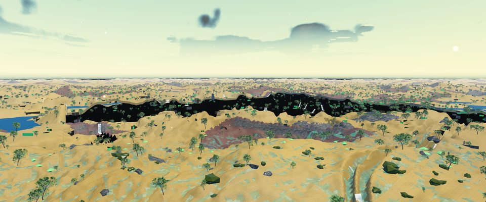
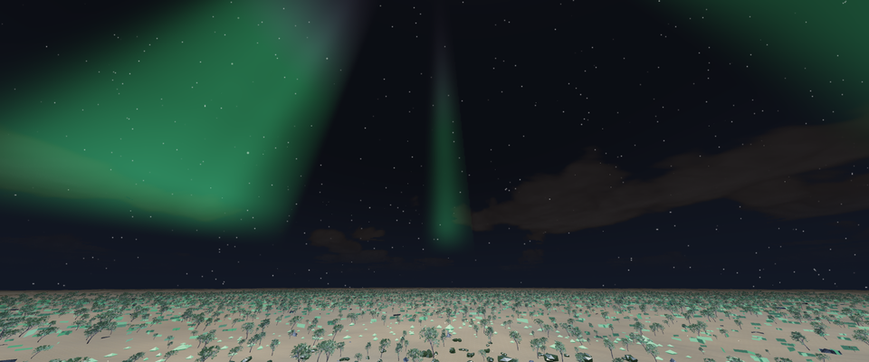

# Documented visual baselines

These September 8, 2026 captures record existing behavior at engine commit
`17c70af79c96d600bde11b0fb13c59b7af15a105`. Both processes exited successfully,
but **neither scenario has received visual approval**. The images expose defects
that the current numeric checks do not reject. They are diagnostic baselines,
not golden references or completed visual improvements.

The full images are lossless PNG conversions of the original 3840×1600 RGB
captures; decoded pixel equality was verified. Inline previews are resized to
960×400. No retouching, generated imagery or additional color grading was applied.
The [receipts](assets/visual-baselines/20260908/receipts.json) record source,
binary, image, input-manifest and support-library hashes.

## Forest reference

[](assets/visual-baselines/20260908/forest-reference.png)

This is an elevated discovery view, not a composed, human-height forest scene.
The broad black terrain band, abrupt transitions, sparse composition and patchy
materials need investigation. A report-frame G-buffer probe at the image center
has depth `1.0` and material `255`, consistent with no geometry at that sampled
point; it does not establish the cause of the entire band.

The report-frame validator passed the requested camera, linked shader uniforms,
time of day, actual streaming position, presence of terrain draws and empty
generation/meshing/upload queues. That result clearly does not establish complete
terrain coverage or acceptable visual quality.

| Recorded input or observation | Value |
|---|---|
| Executable / world | Shipping client; `default`; seed 424242 |
| Camera | Position (8, 56, 8); yaw 35°; pitch −6°; vertical FOV 45° |
| Time of day | 0.04 |
| Render dimensions | 3840×1600; scale 1.0; internal 3840×1600 |
| Sampling | 400 warmup frames, 240 measured frames; separate unmeasured screenshot |
| Mean frame wall time | 6.915 ms, approximately 145 FPS |
| Mean CPU submission / presentation | 3.474 / 3.438 ms |
| Mean GPU pass sum | 3.228 ms; not whole-frame GPU latency |
| Mean GPU board power / graphics clock | 116.7 W / 2881 MHz |
| Report-frame terrain draws | 570; pending generation, meshing and uploads all zero |
| Estimated render allocation | 675,675,128 bytes; not measured GPU memory |

The [complete benchmark report](assets/visual-baselines/20260908/forest-reference.json)
contains pass averages, camera state and G-buffer probes. These are short-run
observations of a defective view. Raw frame samples and p95/p99 were not emitted;
settling was checked only at report time. No qualified whole-frame target is
established for this view. The functional foliage target below does not transfer
automatically to this normal-play workload.

## Foliage diagnostic

[](assets/visual-baselines/20260908/foliage-functional.png)

The existing `foliage_visual_smoke` producer reports a pass. Direct checks also
confirmed its numeric assertions, including the gate's 100,000-instance floor,
image dimensions and capture-pin metadata. The image nevertheless provides a
poor demonstration of foliage: the camera is elevated and points upward, with
most of the frame occupied by sky. There is no calm screenshot for comparison.

| Recorded input or observation | Value |
|---|---|
| Executable / world | QA client; `flat_lands`; seed 424242; 30-second scenario |
| Instances drawn / within ring | 262,144 / 262,144 |
| Foliage draws / reported GL errors | 1 / 0 |
| Observed fade start / end | 48 / 92 m |
| Producer calm / windy `max_sway` | 0 / 9.319; raw wind magnitude, not vertex displacement |
| GPU query sample / declared target | 0.23824 / 0.6 ms |
| Timing interpretation | One last available query sample below the target; no distribution |

See the [producer analysis](assets/visual-baselines/20260908/foliage-functional.json).
The common foliage updater runs after the scenario driver and overwrites its
60/96 m fade, density and controlled wind settings. The scenario also lacks the
daytime override used by other visual captures. These ownership defects prevent
the intended controlled workload from reaching the renderer.

The producer's `max_sway` reads the raw wind vector stored on instances. It does
not measure blade-tip movement: the vertex shader applies amplitude and
oscillation, then caps displacement to 45% of blade height. Neither rendered
motion nor a controlled calm phase has been established by these values. Hash
equality rereads one live instance set; it is not evidence of two independent
rebuilds. The numeric pass does not resolve these gaps or constitute visual
approval.

## Hardware and execution context

Both captures used native Windows 11 Education build 26200, a Ryzen 7 9800X3D
(8 cores, 16 logical processors), and an RTX 5070 Ti with NVIDIA driver 595.97.
The owned rendering process was observed on NVIDIA GPU 0. The engine was built
with GNU UCRT64 15.1.0 in Release mode, first-party warnings as errors, production
OpenGL, and no Diligent, ASan, coverage, Tracy or Steam integration.

Each run used a fresh native-drive runtime, private application settings and
temporary directories, disabled audio/UI, a hidden window and a bounded launcher.
All 261 public input files were hashed; the unchanged Tree Small 02 runtime pack
contributed 22 verified files. No saved worlds or private audio payloads were
copied. Tree Small 02 is by Rico Cilliers / Poly Haven, CC0-1.0; see
[game asset provenance](game-assets.md).

Ordinary desktop GPU clients remained running. No other engine, Blender or build
process was active at preflight. One early process-table query was retained per
run. These observations do not satisfy the paired performance-change policy in
[Performance measurement](performance.md). An earlier UNC-root launch failed
shader/preset loading and was retained locally as a failed attempt; native-drive
execution is the qualified path for these two captures.

## Reproduction and review

Build the recorded revision in an isolated Release tree and prepare a fresh
native-drive runtime with the [required game assets](game-assets.md). From that
runtime, use the matching binary and fresh output paths:

```text
luminumbra_client_app.exe --auto-create-world --auto-enter-world --world-preset default --no-audio --no-ui --no-menu-backdrop --hidden-window --cam-pos 8,56,8 --cam-yaw 35 --cam-pitch -6 --runtime-artifact-dir <output>/artifacts --render-benchmark <output>/benchmark.json --render-benchmark-warmup 400 --render-benchmark-frames 240 --render-benchmark-screenshot <output>/original.ppm

luminumbra_client_qa_app.exe --scenario foliage_visual_smoke --auto-create-world --auto-enter-world --world-preset flat_lands --timed-run 30 --no-audio --no-ui --no-menu-backdrop --hidden-window --runtime-artifact-dir <output>/artifacts
```

Isolate application preferences as well as the runtime directory, and retain
timeouts, failed attempts, input hashes and original frames. For the forest
report, run `tools/perf/validate_render_capture.py` with position `8 56 8`, yaw
`35`, pitch `-6`, TOD `0.04`, `--require-controller`, `--require-geometry` and
`--require-settled`.

The full PowerShell visual gate was not executed. Its tracked callers reference
`Assert-PpmArtifact` and `Assert-CapturePinned` without providing those helpers;
the direct checks used here are not a claim that the wrapper passed.

Each improved scenario requires new screenshots, relevant correctness checks,
honest performance scope and explicit user approval of the concrete result.
Keep these baselines distinct from approved goldens and production acceptance.
